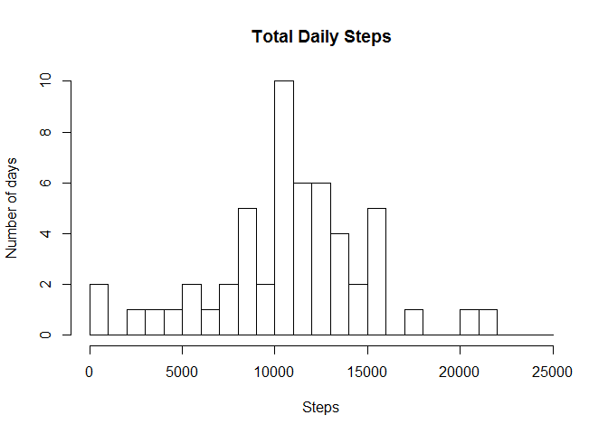
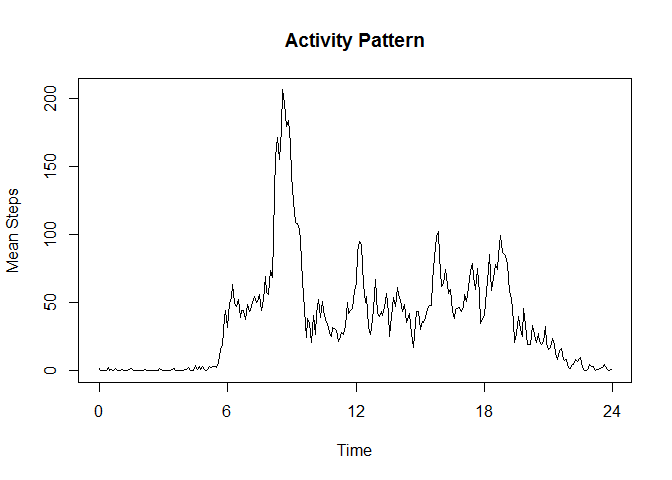
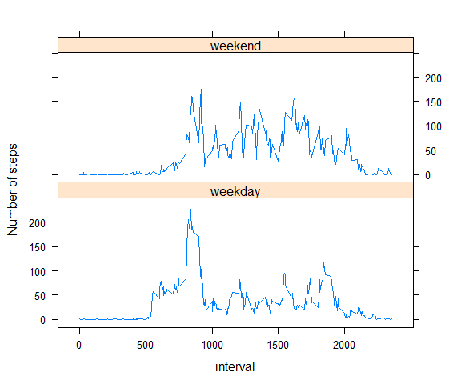

# Reproducible Research: Peer Assessment 1
Robert Cordery  
This assignment makes use of data from a personal activity monitoring device.
This device collects data at 5 minute intervals through out the day. The data
consists of two months of data from an anonymous individual collected during
the months of October and November, 2012 and include the number of steps
taken in 5 minute intervals each day.

## Loading and preprocessing the data


```r
unzip("activity.zip")
activity <- read.csv("activity.csv", stringsAsFactors = FALSE)
activity$date <- as.Date(activity$date)
head(activity)
```

```
##   steps       date interval
## 1    NA 2012-10-01        0
## 2    NA 2012-10-01        5
## 3    NA 2012-10-01       10
## 4    NA 2012-10-01       15
## 5    NA 2012-10-01       20
## 6    NA 2012-10-01       25
```

The interval is an integer coded as hour*100 + minute where hour is from 
0 to 23 and minute is from 0 to 55 by 5. To avoid the jumps from 55 back to zero 
at the start of each hour, I change this to fractions of an hour. 


```r
activity$hour = floor(activity$interval/100) + # hours
    (activity$interval %% 100)/60              # fractional hours
```


## What is mean total number of steps taken per day?
The following is a histogram of the frequency of achieving a number of steps in a day. 
The histogram shows the distribution of total number of steps per day. 
It looks like if he is close to 10000, he puts on a few extra steps!


```r
# totalSteps<-tapply(activity$steps, activity$date,sum, omit.na = TRUE)
totalSteps2 = setNames(aggregate(activity$steps, by=list(date = activity$date), 
                                 sum, omit.na=TRUE, simplify = TRUE),c("date","total_steps"))

meanSteps <- mean(totalSteps2$total_steps, na.rm=TRUE)
medianSteps <- median(totalSteps2$total_steps, na.rm=TRUE)


hist(totalSteps2$total_steps,1000*(0:25), 
     xlab = "Steps", ylab = "Number of days", main="Total Daily Steps")
```

 


Here we caluclate the mean and median number of steps with any NA values skipped.
The mean number of steps is 10767.19.
The median number of steps is 10766. 


## What is the average daily activity pattern?
Most people have a somewhat regular pattern of sleep and activity. 


```r
activityPattern <- tapply(activity$steps, activity$interval ,mean, na.rm = TRUE)
plot( (0:287)*5/60,activityPattern,
     main = "Activity Pattern",
     xlab = "Time",
     ylab = "Mean Steps", 
     type = "l",
     xaxp = c(0,24,4)
     )
```

 

## Imputing missing values
I chose to replace missing values by the mean value for the interval.


```r
imputedSteps <- rep(activityPattern, length.out = length(activity$steps))
imputeRows <- is.na(activity$steps)
activityImputed <- activity
activityImputed$steps[imputeRows] <- imputedSteps[imputeRows]

totalImputedSteps = setNames(aggregate(activityImputed$steps, 
                       by=list(date = activityImputed$date), 
                       sum, omit.na=TRUE, simplify = TRUE),
                       c("date","steps"))
meanImputedSteps <- mean(totalImputedSteps$steps, na.rm=TRUE)
medianImputedSteps <- median(totalImputedSteps$steps, na.rm=TRUE)
```

The mean number of steps with imputed values is 
10767.19, which, as expected,  is exactly the same as the mean 
10767.19 calculated with NA's removed. 
The median number of steps with imputed values is 
10767.19, which is now equal to the mean rather than the value without NA's, which was 10766. 
The mean did not change, because we only added in a number of intervals with their mean value. The median changed to the mean because we replaced a large number of NA's with the mean . 

## Are there differences in activity patterns between weekdays and weekends?


```r
library(chron)
library(lattice)
dayType = factor(c("weekday","weekend"))
activity$dayType = dayType[as.numeric(is.weekend((as.Date(activity$date))))+1]
a<-aggregate(steps ~ interval + dayType, data = activity, FUN= "mean" )

with(a, {
   xyplot(steps ~ interval | dayType, layout=c(1,2), type = "l" ,
          ylab="Number of steps")        
})
```

 

This person's activity is significantly lower on weekdays between the hours of 9:00 and 17:00. 
